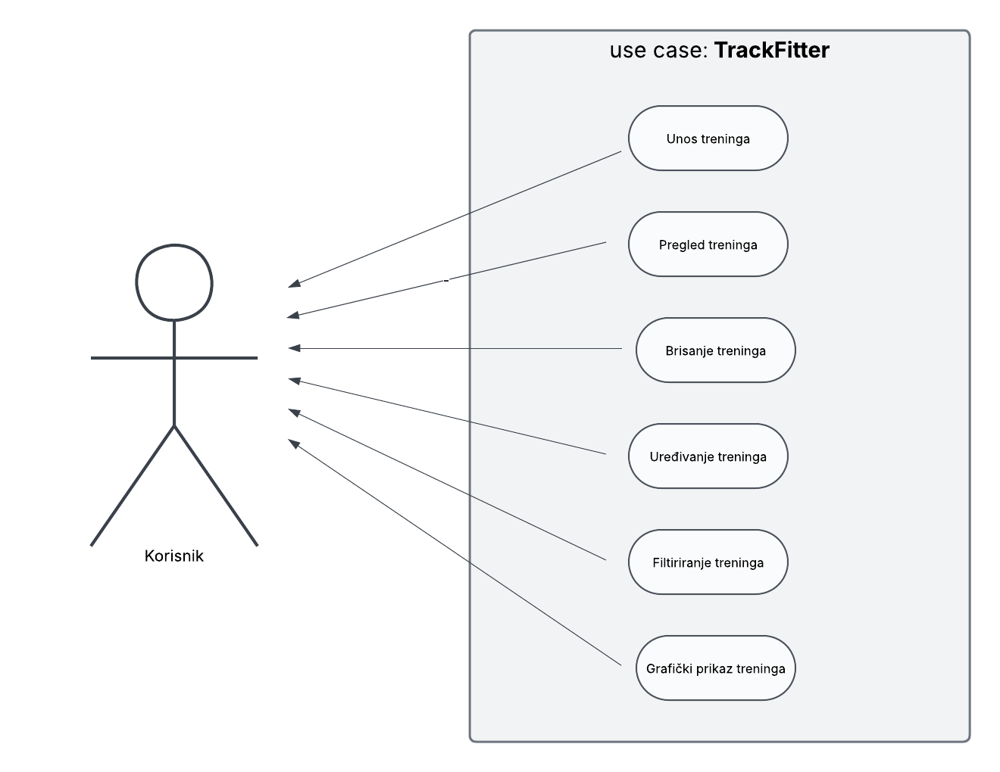

**TrackFitter** je web aplikacija za evidenciju završenih treninga (datum, vrijeme, intenzitet, trajanje, vrsta) i mjesečnu statistiku s vizualizacijama (Chart.js). Frontend i backend su u istom repozitoriju; frontend je kroz Flask templating (Jinja2), backend je Flask web servis s SQLite bazom (PonyORM).

## Funkcionalnosti
- CRUD nad treninzima (unos, pregled, uređivanje, brisanje)
- Mjesečna statistika: broj treninga, ukupno trajanje (min), prosječni intenzitet
- Vizualizacije na `/stats` (linijski i stupčasti graf)
- (Uz to) REST API rute u JSON-u

## Pokretanje s Docker Compose (port 8000)
```bash
git clone https://github.com/valneauljanic/TrackFitter.git
cd TrackFitter
docker compose up --build
# Otvori u pregledniku:
# http://localhost:8000/
Kako spremiti promjene (Git/GitHub)
bash
Copy code
git status
git add .
git commit -m "Update"
git push -u origin main
Tehnologije
Python 3.11, Flask, PonyORM, SQLite, HTML/CSS/Bootstrap, Chart.js, Docker/Compose
